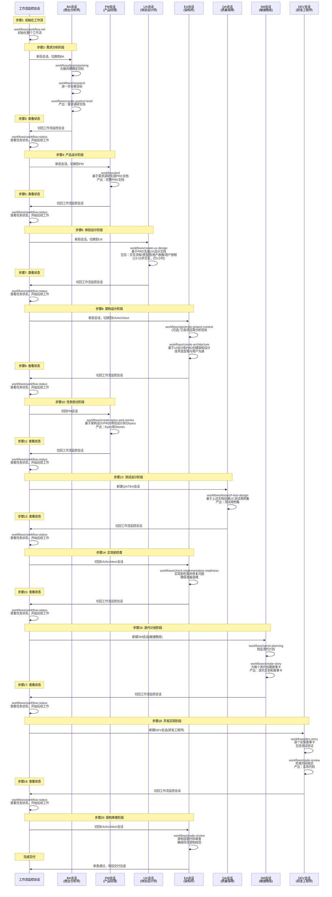

# AI开发工具与框架完整操作手册

本手册提供 AI 驱动开发的完整工具链和框架指南，包括：

- **前置工具安装**：Node.js、Python、C++、Java 等基础环境
- **规格驱动开发**：Spec-Kit、OpenSpec
- **AI 协作框架**：BMAD、Superpowers、Ralph Loop、OMO

---

## 目录

- [前置工具安装](#前置工具安装)
  - [Node.js 与 npm 安装](#nodejs-与-npm-安装)
  - [Bun 安装](#bun-安装)
  - [Python 安装](#python-安装)
  - [C++ 安装](#c-安装)
  - [Java 安装](#java-安装)
- [OpenCode 安装](#opencode-安装)
- [AI Skills 安装教程](#ai-skills-安装教程)
- [Spec-Kit 操作手册](#spec-kit-操作手册)
- [OpenSpec 操作手册](#openspec-操作手册)
- [BMAD 框架](#bmad-框架)
- [Superpowers 框架](#superpowers-框架)
- [Ralph Loop 框架](#ralph-loop-框架)
- [OMO 框架](#omo-框架)

---

## 前置工具安装

### Node.js 与 npm 安装

**macOS 安装：**

```bash
# 方式 1：使用 Homebrew（推荐）
brew install node

# 方式 2：使用 nvm（Node Version Manager）
curl -o- https://raw.githubusercontent.com/nvm-sh/nvm/v0.39.0/install.sh | bash
nvm install --lts
```

**Windows 安装：**

```powershell
# 方式 1：从官网下载安装器（推荐）
# 访问 https://nodejs.org/ 下载 LTS 版本安装

# 方式 2：使用 Chocolatey
choco install nodejs-lts

# 方式 3：使用 Scoop
scoop install nodejs-lts
```

**验证安装：**

```bash
node --version
npm --version
```

### Bun 安装

Bun 是一个快速的 JavaScript 运行时，可以替代 Node.js 和 npm，速度更快。

**macOS / Linux 安装：**

```bash
# 使用安装脚本（推荐）
curl -fsSL https://bun.sh/install | bash

# 或使用 Homebrew
brew install oven-sh/bun/bun
```

**Windows 安装：**

```powershell
# 使用 PowerShell
powershell -c "irm bun.sh/install.ps1 | iex"

# 或使用 Scoop
scoop install bun

# 或使用 npm（需要先安装 Node.js）
npm install -g bun
```

**验证安装：**

```bash
bun --version
```

**npx 说明：**

npx 是 npm 5.2.0+ 自带的工具，无需单独安装。安装 Node.js 后即可使用。

```bash
# 验证 npx
npx --version
```

---

### Python 安装

Python 是最流行的 AI 开发语言，建议安装 3.11+ 版本。

**macOS 安装：**

```bash
# 方式 1：使用 Homebrew（推荐）
brew install python@3.11

# 方式 2：使用 pyenv（多版本管理）
brew install pyenv
pyenv install 3.11.7
pyenv global 3.11.7

# 方式 3：从官网下载
# 访问 https://www.python.org/downloads/macos/
```

**Windows 安装：**

```powershell
# 方式 1：从官网下载安装器（推荐）
# 访问 https://www.python.org/downloads/windows/
# ⚠️ 安装时勾选 "Add Python to PATH"

# 方式 2：使用 Chocolatey
choco install python --version=3.11

# 方式 3：使用 Scoop
scoop install python

# 方式 4：使用 Microsoft Store
# 搜索 "Python 3.11" 直接安装
```

**验证安装：**

```bash
python --version
# 或
python3 --version

# 检查 pip
pip --version
# 或
pip3 --version
```

**包管理器推荐：**

```bash
# 安装 uv（现代化的 Python 包管理器，速度极快）
curl -LsSf https://astral.sh/uv/install.sh | sh  # macOS/Linux
# 或
powershell -c "irm https://astral.sh/uv/install.ps1 | iex"  # Windows

# 安装 poetry（项目依赖管理）
curl -sSL https://install.python-poetry.org | python3 -  # macOS/Linux
# 或
(Invoke-WebRequest -Uri https://install.python-poetry.org -UseBasicParsing).Content | python -  # Windows
```

---

### C++ 安装

C++ 开发需要编译器和构建工具。

**macOS 安装：**

```bash
# 方式 1：安装 Xcode Command Line Tools（推荐）
xcode-select --install

# 方式 2：安装完整 Xcode（从 App Store）
# 包含 Clang/LLVM 编译器

# 方式 3：使用 Homebrew 安装 GCC
brew install gcc

# 方式 4：安装 LLVM
brew install llvm
```

**验证 macOS 安装：**

```bash
# 检查 Clang（Apple 默认编译器）
clang --version

# 检查 GCC（如果安装）
gcc --version
g++ --version

# 检查 CMake（构建工具）
brew install cmake
cmake --version
```

**Windows 安装：**

```powershell
# 方式 1：Visual Studio（推荐，包含 MSVC 编译器）
# 下载地址: https://visualstudio.microsoft.com/downloads/
# 安装时选择 "Desktop development with C++"

# 方式 2：Visual Studio Build Tools（仅命令行工具）
# 下载地址: https://visualstudio.microsoft.com/downloads/
# 选择 "Build Tools for Visual Studio 2022"

# 方式 3：MinGW-w64（GCC for Windows）
# 使用 Chocolatey
choco install mingw

# 使用 Scoop
scoop install gcc

# 方式 4：安装 Clang/LLVM
choco install llvm
```

**验证 Windows 安装：**

```powershell
# 检查 MSVC（Visual Studio）
cl  # 需要在 "Developer Command Prompt for VS" 中运行

# 检查 MinGW GCC
gcc --version
g++ --version

# 检查 Clang
clang --version

# 检查 CMake
choco install cmake  # 如果未安装
cmake --version
```

**C++ 构建工具推荐：**

```bash
# CMake（跨平台构建工具）
# macOS
brew install cmake

# Windows
choco install cmake
# 或
scoop install cmake

# Ninja（快速构建系统）
# macOS
brew install ninja

# Windows
choco install ninja
# 或
scoop install ninja

# vcpkg（C++ 包管理器）
git clone https://github.com/Microsoft/vcpkg.git
cd vcpkg
./bootstrap-vcpkg.sh  # macOS/Linux
# 或
./bootstrap-vcpkg.bat  # Windows
```

---

### Java 安装

Java 是企业级应用的主流语言，建议安装 JDK 17+ LTS 版本。

**macOS 安装：**

```bash
# 方式 1：使用 Homebrew 安装 OpenJDK（推荐）
brew install openjdk@17

# 配置环境变量（添加到 ~/.zshrc 或 ~/.bash_profile）
echo 'export PATH="/opt/homebrew/opt/openjdk@17/bin:$PATH"' >> ~/.zshrc
source ~/.zshrc

# 方式 2：使用 SDKMAN（多版本管理，推荐）
curl -s "https://get.sdkman.io" | bash
source "$HOME/.sdkman/bin/sdkman-init.sh"
sdk install java 17.0.10-tem  # Temurin JDK 17
sdk default java 17.0.10-tem

# 方式 3：从 Oracle 官网下载
# 访问 https://www.oracle.com/java/technologies/downloads/

# 方式 4：安装 Azul Zulu JDK
brew tap mdogan/zulu
brew install zulu-jdk17
```

**Windows 安装：**

```powershell
# 方式 1：使用 Chocolatey 安装 OpenJDK（推荐）
choco install openjdk17

# 方式 2：使用 Scoop 安装
scoop bucket add java
scoop install openjdk17

# 方式 3：使用 Microsoft Build of OpenJDK
# 下载地址: https://www.microsoft.com/openjdk

# 方式 4：从 Oracle 官网下载安装器
# 访问 https://www.oracle.com/java/technologies/downloads/
# ⚠️ 安装后需手动配置 JAVA_HOME 环境变量

# 方式 5：使用 SDKMAN（需要 Git Bash 或 WSL）
# 在 Git Bash 中运行
curl -s "https://get.sdkman.io" | bash
source "$HOME/.sdkman/bin/sdkman-init.sh"
sdk install java 17.0.10-tem
```

**配置 Windows 环境变量（手动安装时）：**

```powershell
# 1. 设置 JAVA_HOME（以管理员身份运行 PowerShell）
[System.Environment]::SetEnvironmentVariable('JAVA_HOME', 'C:\Program Files\Java\jdk-17', 'Machine')

# 2. 添加到 PATH
$path = [System.Environment]::GetEnvironmentVariable('Path', 'Machine')
[System.Environment]::SetEnvironmentVariable('Path', "$path;%JAVA_HOME%\bin", 'Machine')

# 3. 重启终端使其生效
```

**验证安装：**

```bash
# 检查 Java 版本
java -version

# 检查 Javac 编译器
javac -version

# 检查 JAVA_HOME
echo $JAVA_HOME  # macOS/Linux
echo %JAVA_HOME%  # Windows CMD
echo $env:JAVA_HOME  # Windows PowerShell
```

**Java 构建工具推荐：**

```bash
# Maven（项目管理和构建工具）
# macOS
brew install maven

# Windows
choco install maven
# 或
scoop install maven

# 验证
mvn -version

# Gradle（现代构建工具）
# macOS
brew install gradle

# Windows
choco install gradle
# 或
scoop install gradle

# 验证
gradle -version

# jEnv（多版本 Java 管理，macOS/Linux）
brew install jenv
echo 'export PATH="$HOME/.jenv/bin:$PATH"' >> ~/.zshrc
echo 'eval "$(jenv init -)"' >> ~/.zshrc
jenv add /path/to/java/home
jenv versions
```

---

## OpenCode 安装

> **重要**：OpenCode 是使用 OMO 的必要基础，也支持 Superpowers 等框架的安装。

### 前置要求

- Node.js v20+ 或 Bun
- 至少一个 AI 订阅（Claude Pro/Max、ChatGPT Plus、Gemini 或 GitHub Copilot）

### 安装步骤

**方式 1：使用安装脚本（推荐）**

```bash
# macOS / Linux
curl -fsSL https://opencode.ai/install.sh | bash

# Windows (PowerShell)
curl -fsSL https://opencode.ai/install | bash
```

**方式 2：使用包管理器**

```bash
# 使用 npm
npm install -g @opencode/cli

# 使用 Bun（推荐，速度更快）
bun install -g @opencode/cli
```

### 初始化配置

```bash
# 初始化 OpenCode
opencode init

# 根据提示配置 AI 模型订阅
# 可选：Claude API、OpenAI API、Gemini API、GitHub Copilot
```

### 验证安装

```bash
opencode --version
opencode help
```

**参考资料：**

- [OpenCode 官方文档](https://opencode.ai/docs)
- [OpenCode GitHub](https://github.com/opencode-ai/opencode)

---

## AI Skills 安装教程

本章节补充 3 个常用技能/工具的安装方式：

1. `ui-ux-pro-max-skill`
2. `vercel-labs/agent-skills`
3. `vercel-labs/agent-browser`

### 1) ui-ux-pro-max-skill 安装

仓库地址：[`nextlevelbuilder/ui-ux-pro-max-skill`](https://github.com/nextlevelbuilder/ui-ux-pro-max-skill)

**方式 A：使用官方 CLI（推荐）**

```bash
# 1. 安装 CLI
npm install -g uipro-cli

# 2. 进入你的项目目录
cd /path/to/your/project

# 3. 按你的 AI 工具安装
uipro init --ai claude      # Claude Code
uipro init --ai cursor      # Cursor
uipro init --ai windsurf    # Windsurf
uipro init --ai codex       # Codex
uipro init --ai all         # 全部支持的助手
```

**方式 B：指定版本安装/升级**

```bash
# 查看可用版本
uipro versions

# 安装指定版本
uipro init --version v1.0.0

# 升级到最新
uipro update
```

---

### 2) vercel-labs/agent-skills 安装

仓库地址：[`vercel-labs/agent-skills`](https://github.com/vercel-labs/agent-skills)

**方式 A：安装整个技能仓库（推荐）**

```bash
npx skills add vercel-labs/agent-skills
```

**方式 B：先列出可安装技能再选择**

```bash
# 列出仓库内技能（不安装）
npx skills add vercel-labs/agent-skills --list

# 安装指定技能（示例）
npx skills add vercel-labs/agent-skills --skill frontend-design
```

**方式 C：安装到指定助手/全局目录**

```bash
# 安装到指定助手（示例：claude-code + opencode）
npx skills add vercel-labs/agent-skills -a claude-code -a opencode

# 全局安装（跨项目可用）
npx skills add vercel-labs/agent-skills -g
```

**常用检查命令**

```bash
# 查看已安装技能
npx skills list

# 检查更新
npx skills check

# 更新技能
npx skills update
```

---

### 3) vercel-labs/agent-browser 安装

仓库地址：[`vercel-labs/agent-browser`](https://github.com/vercel-labs/agent-browser)

`agent-browser` 是 AI Agent 的浏览器自动化 CLI，常用于端到端测试与网页操作。

**方式 A：npm 安装（推荐）**

```bash
# 1. 全局安装 CLI
npm install -g agent-browser

# 2. 下载 Chromium
agent-browser install
```

**Linux 额外依赖（如需要）**

```bash
agent-browser install --with-deps
# 或
npx playwright install-deps chromium
```

**快速验证**

```bash
agent-browser open example.com
agent-browser snapshot
agent-browser close
```

**可选：集成 Claude Code Skill**

```bash
# 从 node_modules 复制 skill（示例）
cp -r node_modules/agent-browser/skills/agent-browser .claude/skills/

# 或直接下载 SKILL.md
mkdir -p .claude/skills/agent-browser
curl -o .claude/skills/agent-browser/SKILL.md \
  https://raw.githubusercontent.com/vercel-labs/agent-browser/main/skills/agent-browser/SKILL.md
```

---

## Spec-Kit 操作手册

### 📦 安装步骤

```bash
# 1. 安装 uv 包管理器 (要求 Python 3.11+)
curl -LsSf https://astral.sh/uv/install.sh | sh  # macOS/Linux
# 或
powershell -c "irm https://astral.sh/uv/install.ps1 | iex"  # Windows

# 2. 全局安装 Spec-Kit CLI
uv tool install specify-cli --from git+https://github.com/github/spec-kit.git

# 3. 初始化项目 (在项目目录下执行)
specify init

# 4. 验证安装
specify check
```

**官方文档**: [https://github.com/github/spec-kit](https://github.com/github/spec-kit)

---

### 🎯 使用流程

**核心四步法**: Specify → Plan → Tasks → Implement

#### 第1步: 设定项目规范 (Constitution)

```text
/speckit.constitution 使用 TypeScript,禁止 any 类型。组件必须单一职责。遵循《重构》中的坏味道定位原则。
```

**作用**: 定义整个项目的编码规范、架构约束、团队约定(项目宪法)

---

#### 第2步: 描述需求 (Specify)

```text
/speckit.specify 开发一个番茄时钟 Web 应用。
功能包括:
1. 25分钟工作计时,5分钟休息计时
2. 任务列表管理
3. 工作统计图表
4. 本地存储数据
5. 支持暗黑模式
```

**作用**: 描述"做什么"(需求层面),无需关心"怎么做"

---

#### 第3步: 生成技术方案 (Plan) ⚠️ 关键检查点

```text
/speckit.plan 使用 React + TypeScript 实现单页应用。
使用 Context API 管理状态,localStorage 存储数据。
UI 采用 CSS Grid 布局,支持响应式设计。
```

**作用**: AI 生成详细的技术方案文档

**⚠️ 必须人工审核**:

- 检查接口契约是否完整(前后端分离项目)
- 检查技术选型是否合理
- 检查功能覆盖是否完整
- 这一步是质量保证的核心!

---

#### 第4步: 拆解任务 (Tasks)

```text
/speckit.tasks
```

**作用**: AI 将技术方案拆解为可执行的任务清单

---

#### 第5步: 开始实现 (Implement)

```text
/speckit.implement
```

**作用**: AI 基于任务清单逐个编码实现

---

### ✅ 最佳实践

| 适用场景             | 说明                                   |
| -------------------- | -------------------------------------- |
| ✅ **Epic 级新项目** | 从零到一的大型单端项目(纯前端或纯后端) |
| ✅ **需要严格规范**  | 团队协作,需要统一架构和编码规范        |
| ❌ **前后端强耦合**  | 接口契约管理不稳定,需额外人工补充      |
| ❌ **小型快速需求**  | 流程相对重,不如直接 VB Coding          |

---

### ⚠️ 注意事项

1. **必须配置测试**: SDD 模式下,测试是生命线,用于验证 AI 生成的代码是否符合预期
2. **前后端项目**: 需在 Constitution 中明确要求生成接口契约(OpenAPI 格式),并人工审核
3. **推荐模型**: Claude 4.5 Sonnet 或 OPS (方案生成质量最佳)
4. **Git 管理**: 每个阶段建议提交 commit,方便回滚
5. **中文化**: 可将 `.cursor/commands` 目录下的提示词翻译成中文

---

## OpenSpec 操作手册

### 📦 安装与升级/降级

```bash
# 1. 全局安装最新版 (要求 Node.js 20.19+)
npm install -g @fission-ai/openspec@latest

# 2. 验证版本
openspec --version
npm ls -g @fission-ai/openspec

# 3. 初始化项目 (在项目目录下执行)
openspec init
```

**版本升级（升级到最新版）**

```bash
npm un -g @fission-ai/openspec
npm install -g @fission-ai/openspec@latest
openspec --version
```

**版本降级（回退到指定版本）**

```bash
# 示例：回退到 v0.23.0
npm un -g @fission-ai/openspec
npm install -g @fission-ai/openspec@v0.23.0
openspec --version
```

**版本切换排错（可选）**

```bash
# 如遇版本冲突,可先卸载再安装
npm uninstall -g @fission-ai/openspec
npm install -g @fission-ai/openspec@latest
npm ls -g @fission-ai/openspec
```

**官方文档**: [https://github.com/fission-codes/openspec](https://github.com/fission-codes/openspec)


---

### 🧭 旧版工作流（保留）

> 适用于历史项目、团队仍在使用 `/openspec:*` 指令的场景。

**核心流程**: Proposal → Apply → Archive

#### 第1步: 创建变更提案（Proposal）

```text
/openspec:proposal 增加图片点赞功能。
每个图片下方显示心形图标和点赞数，点击时有弹跳动画效果。
```

**作用**: 描述要做什么变更，AI 自动生成 Proposal 文档。

---

#### 第2步: 查看与审核提案

```bash
# 查看所有提案
openspec list

# 查看具体提案内容
openspec show add-like-feature
```

**⚠️ 必须人工审核**:

- 检查需求理解是否准确
- 检查技术方案是否完整
- 如需调整，直接编辑提案文件或重新生成

---

#### 第3步: 应用提案（Apply）

```text
/openspec:apply add-like-feature
```

**作用**: AI 基于审核通过的提案自动编码实现。

---

#### 第4步: 测试验证

手动或自动测试变更是否符合预期。

---

#### 第5步: 归档提案（Archive）

```text
/openspec:archive add-like-feature
```

**作用**: 将变更合并到主 Spec，形成项目知识库。

---

### 🔁 新旧命令对照

| 老版本 (`/openspec:*`) | 新版本 (`/opsx:*`) |
|------------------------|-------------------|
| `/openspec:proposal` | `/opsx:new` + `/opsx:continue` 或 `/opsx:ff` |
| `/openspec:apply` | `/opsx:apply` |
| `/openspec:archive` | `/opsx:archive` + `/opsx:sync` |

---

### 🚀 新版工作流（OPSX）

OpenSpec 新版从旧的线性阶段流转为 **Action-based** 模式，核心流程为：

**Explore → New → Build(continue/ff) → Apply → Verify → Archive → Sync**

#### 第1步: 探索问题（可选）

```text
/opsx:explore 帮我分析图片点赞功能的实现方案和风险。
```

**作用**: 先调研和澄清需求，不创建文件。

---

#### 第2步: 创建变更

```text
/opsx:new add-like-feature
```

**作用**: 创建独立变更目录 `openspec/changes/add-like-feature/`。

---

#### 第3步: 构建文档（两种模式）

```text
# 步进模式（逐步生成，适合复杂需求）
/opsx:continue

# 快进模式（一次生成，适合简单需求）
/opsx:ff
```

**作用**: 生成规划与任务产物；复杂需求建议使用 `continue` 逐步审阅。

---

#### 第4步: 执行实现

```text
/opsx:apply
```

**作用**: AI 按任务列表自动实现代码并更新相关文档。

---

#### 第5步: 自动审计

```text
/opsx:verify
```

**作用**: 从 CRITICAL/WARNING/SUGGESTION 维度检查实现与规格一致性。

---

#### 第6步: 归档与同步

```text
/opsx:archive
/opsx:sync
```

**作用**: 先归档变更，再把局部修改同步到全局规格（Source of Truth）。

---

### 📘 常用命令速查（新版）

| 命令 | 含义 | 典型场景 |
|------|------|----------|
| `/opsx:explore` | 方案探索与调研 | 需求不清、需先分析 |
| `/opsx:new <id>` | 创建变更工作区 | 正式开始需求 |
| `/opsx:continue` | 步进构建文档 | 高风险/复杂需求 |
| `/opsx:ff` | 快进构建文档 | 常规小需求 |
| `/opsx:apply` | 执行任务并编码 | 文档确认后实施 |
| `/opsx:verify` | 自动质量审计 | 提交前质检 |
| `/opsx:archive` | 归档当前变更 | 合并完成后 |
| `/opsx:bulk-archive` | 批量归档变更 | 多个需求集中收尾 |
| `/opsx:sync` | 同步到全局规格 | 确保下次任务基于最新真相 |
| `/opsx:onboard` | 新手引导 | 首次使用新版 |


### ✅ 最佳实践

1. **需求先探索**: 不确定需求时先用 `/opsx:explore`,避免直接开工返工
2. **复杂需求走步进**: `continue` 便于每一步人工审核
3. **提交前强制验证**: `verify` 作为 PR 前置检查
4. **归档后立即同步**: `archive` 后执行 `sync`,保证规格库持续可用
5. **版本固定**: 团队内可统一版本号,避免成员命令行为不一致

---

### ⚠️ 注意事项

1. **命令前缀变化**: 新版主要使用 `/opsx:*`,不要与 `/openspec:*` 混用
2. **升级后先验收**: 升级或降级后都执行一次 `openspec --version` 与最小流程验证
3. **变更粒度控制**: 每个 change id 聚焦单一业务目标,避免范围失控
4. **配合测试**: `apply` 和 `verify` 后仍需执行项目测试
5. **Git 管理**: 关键节点（new 前/verify 后/archive 前）建议提交 commit

---

## BMAD 框架

### 框架简介

BMAD（Business Modeling and Architecture Development）提供完整的软件工程流程，包含 BA、PM、UX、EA、QA、SM、DEV 等 7 大专业角色。

**适用场景：**

- 需要完整方案文档的项目
- 对质量要求极高的场景
- 学习软件工程全流程的标准操作

**代价：** 时间成本高（5-6 小时起步）

### 安装步骤

**前置要求：**

- Node.js v20+
- AI IDE（Claude Code、Cursor、Windsurf 等）

**安装命令：**

```bash
npx bmad-method install
```

按照安装向导提示完成配置，然后在项目目录中打开 AI IDE。

**验证安装：**

```bash
# 在 AI IDE 会话框 中运行
/bmad-help
```

成功后会看到完整的命令列表和使用指南。

### 使用步骤

BMAD 采用多角色、多会话的工作方式，每个角色在独立会话中工作。

#### 完整工作流程（20 步）

**步骤 1：初始化工作流**

在工作流监控会话中运行：

```bash
/workflows/workflow-init
```

**步骤 2-3：需求分析阶段（BA）**

新建 BA 会话，执行以下工作流：

```bash
# 1. 头脑风暴确定目标
/workflows/brainstorming

# 2. 进一步完善目标
/workflows/research

# 3. 产出需求调研文档
/workflows/create-product-brief
```

**步骤 4-5：产品设计阶段（PM）**

新建 PM 会话：

```bash
# 基于需求调研生成 PRD 文档
/workflows/prd
```

**步骤 6-7：体验设计阶段（UX）**

新建 UX 会话：

```bash
# 基于 PRD 生成 UX 设计文档
# 包含：交互流程/原型图/用户画像/用户旅程
/workflows/create-ux-design
```

**步骤 8-9：架构设计阶段（EA）**

新建 EA/Architect 会话：

```bash
# 可选：已有项目需分析现状
/workflows/generate-project-context

# 基于 UI 设计和 PRD 创建架构设计
/workflows/create-architecture
```

**步骤 10-11：任务拆分阶段（PM）**

切回 PM 会话：

```bash
# 基于架构设计/PRD/体验设计拆分任务
/workflows/create-epics-and-stories
```

**步骤 12-13：测试设计阶段（QA）**

新建 QA/TEA 会话：

```bash
# 创建测试用例集
/workflows/testarch-test-design
```

**步骤 14-15：实现前检查（EA）**

切回 EA/Architect 会话：

```bash
# 实现前检查并修复问题
/workflows/check-implementation-readiness
```

**步骤 16-17：迭代计划阶段（SM）**

新建 SM 会话（敏捷教练）：

```bash
# 制定迭代计划
/workflows/sprint-planning

# 为每个迭代创建故事卡
/workflows/create-story
```

**步骤 18-19：开发实现阶段（DEV）**

新建 DEV 会话（研发工程师）：

```bash
# 逐个实现故事卡
/workflows/dev-story

# 检查代码规范
/workflows/code-review
```

**步骤 20：架构审查阶段（EA）**

切回 EA/Architect 会话：

```bash
# 架构层面代码审查
/workflows/code-review
```

#### 查看工作流状态

在任何阶段，可以切回工作流监控会话查看进度：

```bash
/workflows/workflow-status
```

#### BMAD 完整工作流时序图

下面用时序图展示 BMAD 中不同会话（角色）之间的协作流程：



### 核心特点

- ✅ **角色专业化**：每个 AI 角色相当于该领域专家
- ✅ **工作流固化**：标准操作流程保证质量
- ✅ **文档模板化**：标准文档模板便于协作
- ✅ **会话隔离**：独立会话避免上下文污染
- ⚠️ **时间成本高**：完整流程需要 5-6 小时以上

**参考资料：**

- [BMAD 官方文档](https://github.com/bmad-code-org/BMAD-METHOD)
- [BMAD 实战案例](https://github.com/Jxin-Cai/VB-Coding-Demo/tree/main/sdd/bmad)

### V6 升级变更（V6 vs V4 对照）

#### 架构层面变化

| 对比项 | v4（旧版） | v6（当前版） |
|--------|-----------|-------------|
| 安装目录 | `.bmad-method`（点文件夹，部分 LLM 不可见） | `_bmad/`（下划线前缀，确保所有 LLM 可见） |
| 核心定义 | `_bmad-core` 即 BMad Method 本身 | `_bmad/core/` 是通用框架，`_bmad/bmm/` 才是 BMad Method |
| 配置方式 | 直接修改源文件 | 每个模块独立 `config.yaml`，通过 `.customize.yaml` 自定义 |
| 文档管理 | 需预先选择分片/不分片模式 | 完全灵活，自动扫描识别 |
| 命令命名 | 不统一，有嵌套目录 | 统一扁平化：`bmad-<module>-<workflow>.md` |
| 安装器 | 各 IDE 独立实现 | 统一 `UnifiedInstaller`，所有 IDE 共用 |

#### 命令变更对照

v4 必须先加载代理，再通过代理菜单触发工作流。v6 支持直接通过斜杠命令运行：

```
# v4 方式：先加载代理，再触发
/bmad-agent-bmm-pm    → 加载 PM 代理 → 输入 "PRD" 触发工作流

# v6 方式：直接运行（也仍然支持 v4 方式）
/bmad-bmm-create-prd  → 直接启动 PRD 创建工作流
```

v6 完整命令速查：

| 阶段 | v6 命令 | 用途 |
|------|---------|------|
| 引导 | `/bmad-help` | 智能引导，查看状态和推荐 |
| 分析 | `/bmad-bmm-create-product-brief` | 创建产品简报 |
| 分析 | `/bmad-bmm-market-research` | 市场研究 |
| 分析 | `/bmad-bmm-domain-research` | 领域研究 |
| 分析 | `/bmad-bmm-technical-research` | 技术研究 |
| 规划 | `/bmad-bmm-create-prd` | 创建 PRD |
| 规划 | `/bmad-bmm-validate-prd` | 验证 PRD |
| 规划 | `/bmad-bmm-create-ux-design` | 创建 UX 设计 |
| 方案 | `/bmad-bmm-create-architecture` | 创建架构 |
| 方案 | `/bmad-bmm-create-epics-and-stories` | 创建 Epics 和 Stories |
| 方案 | `/bmad-bmm-check-implementation-readiness` | 实施准备检查 |
| 实施 | `/bmad-bmm-sprint-planning` | Sprint 规划 |
| 实施 | `/bmad-bmm-create-story` | 创建 Story |
| 实施 | `/bmad-bmm-dev-story` | 开发 Story |
| 实施 | `/bmad-bmm-code-review` | 代码审查 |
| 实施 | `/bmad-bmm-correct-course` | 纠正路线 |
| 实施 | `/bmad-bmm-retrospective` | 回顾 |
| 快速 | `/bmad-bmm-quick-spec` | 快速生成技术规范 |
| 快速 | `/bmad-bmm-quick-dev` | 快速实现 |
| 工具 | `/bmad-bmm-generate-project-context` | 生成项目上下文 |
| 工具 | `/bmad-bmm-document-project` | 生成项目文档 |
| 协作 | `/bmad-brainstorming` | 头脑风暴（60+ 种技术） |
| 协作 | `/bmad-party-mode` | 多代理协作讨论 |

#### V6 新增模式与功能

**（1）bmad-help 智能引导系统**

v4 使用 `workflow-init` 和手动工作流跟踪。v6 引入 bmad-help，自动检测项目状态、自然语言交互、智能路由推荐工作流，每个工作流结束后自动调用告知下一步。

```
/bmad-help                          # 查看当前状态和推荐
/bmad-help 我卡在 PRD 工作流了       # 获取针对性帮助
```

**（2）Quick Flow 快速开发轨道**

新增轻量级开发路径，跳过完整 PRD/架构流程，适合小型变更（Bug 修复、小功能、重构）：

```
/bmad-bmm-quick-spec    # 生成技术规范
/bmad-bmm-quick-dev     # 根据规范实现代码
```

内置范围检测：如果发现任务过大，自动建议升级到完整流程。

**（3）模块化生态系统**

v6 将框架拆分为独立模块，按需安装：

| 模块 | 代码 | 用途 |
|------|------|------|
| BMad Method | `bmm` | 核心敏捷开发框架（34+ 工作流） |
| BMad Builder | `bmb` | 创建自定义代理和工作流 |
| Creative Intelligence Suite | `cis` | 创新、头脑风暴、设计思维 |
| Game Dev Studio | `gds` | 游戏开发工作流 |
| Test Architect | `tea` | 企业级测试策略和自动化 |

**（4）Party Mode（多代理协作）**

把多个 AI 代理拉进同一个对话讨论，适用于重大技术决策、头脑风暴、Sprint 回顾等场景：

```
/bmad-party-mode
```

**（5）其他改进**

- Epics & Stories 创建移到架构设计之后，Stories 能直接反映架构决策
- 新增跨文件引用验证器，扫描约 483 个引用检测断裂引用
- Windows 兼容性改进（迁移到 @clack/prompts）
- 支持非交互式安装（CI/CD）：`npx bmad-method install --modules bmm --tools claude-code --yes`

---

## Superpowers 框架

### 框架简介

Superpowers 是简洁高效的 SDD 框架，核心理念是用户只需聚焦需求澄清和方案选型，后续交给 AI 自动完成。

**适用场景：**

- 快速 Demo 开发
- 标准 CRUD 功能
- 可接受"炼丹"（样式/交互靠运气）的项目

**代价：** 方案定制困难，非标准需求风险高

### 安装步骤

**前置要求：**

- Claude Code 或 OpenCode
- Git 跟踪的项目目录

**Claude Code 安装：**

```bash
# 1. 注册插件市场
/plugin marketplace add obra/superpowers-marketplace

# 2. 从市场安装插件
/plugin install superpowers@superpowers-marketplace
```

**OpenCode 安装：**

Superpowers 在 OpenCode 中的安装分为自动安装和手动安装两种方式。

基于 opencode 安装,直接输入一下内容

```shell
Clone https://github.com/obra/superpowers to ~/.config/opencode/superpowers, then create directory ~/.config/opencode/plugins, then symlink ~/.config/opencode/superpowers/.opencode/plugins/superpowers.js to ~/.config/opencode/plugins/superpowers.js, then symlink ~/.config/opencode/superpowers/skills to ~/.config/opencode/skills/superpowers, then restart opencode.
```

**手动安装**

<details>
<summary>macOS / Linux 手动安装步骤</summary>

```bash
# 1. 安装或更新 Superpowers
if [ -d ~/.config/opencode/superpowers ]; then
  cd ~/.config/opencode/superpowers && git pull
else
  git clone https://github.com/obra/superpowers.git ~/.config/opencode/superpowers
fi

# 2. 创建目录
mkdir -p ~/.config/opencode/plugins ~/.config/opencode/skills

# 3. 删除旧的符号链接（如果存在）
rm -f ~/.config/opencode/plugins/superpowers.js
rm -rf ~/.config/opencode/skills/superpowers

# 4. 创建符号链接
ln -s ~/.config/opencode/superpowers/.opencode/plugins/superpowers.js ~/.config/opencode/plugins/superpowers.js
ln -s ~/.config/opencode/superpowers/skills ~/.config/opencode/skills/superpowers

# 5. 重启 OpenCode
```

</details>

<details>
<summary>Windows 手动安装步骤</summary>

**前置要求：**

- Git 已安装
- 启用开发者模式（Settings → System → For developers）或使用管理员权限

**PowerShell 安装（推荐）：**

以管理员身份运行 PowerShell，或启用开发者模式后运行：

```powershell
# 1. 安装 Superpowers
git clone https://github.com/obra/superpowers.git "$env:USERPROFILE\.config\opencode\superpowers"

# 2. 创建目录
New-Item -ItemType Directory -Force -Path "$env:USERPROFILE\.config\opencode\plugins"
New-Item -ItemType Directory -Force -Path "$env:USERPROFILE\.config\opencode\skills"

# 3. 删除旧的链接（如果存在）
Remove-Item "$env:USERPROFILE\.config\opencode\plugins\superpowers.js" -Force -ErrorAction SilentlyContinue
Remove-Item "$env:USERPROFILE\.config\opencode\skills\superpowers" -Force -ErrorAction SilentlyContinue

# 4. 创建插件符号链接（需要开发者模式或管理员权限）
New-Item -ItemType SymbolicLink -Path "$env:USERPROFILE\.config\opencode\plugins\superpowers.js" -Target "$env:USERPROFILE\.config\opencode\superpowers\.opencode\plugins\superpowers.js"

# 5. 创建 skills 目录连接（无需特殊权限）
New-Item -ItemType Junction -Path "$env:USERPROFILE\.config\opencode\skills\superpowers" -Target "$env:USERPROFILE\.config\opencode\superpowers\skills"

# 6. 重启 OpenCode
```

**Command Prompt 安装：**

以管理员身份运行 CMD，或启用开发者模式后运行：

```cmd
:: 1. 安装 Superpowers
git clone https://github.com/obra/superpowers.git "%USERPROFILE%\.config\opencode\superpowers"

:: 2. 创建目录
mkdir "%USERPROFILE%\.config\opencode\plugins" 2>nul
mkdir "%USERPROFILE%\.config\opencode\skills" 2>nul

:: 3. 删除旧的链接（如果存在）
del "%USERPROFILE%\.config\opencode\plugins\superpowers.js" 2>nul
rmdir "%USERPROFILE%\.config\opencode\skills\superpowers" 2>nul

:: 4. 创建插件符号链接（需要开发者模式或管理员权限）
mklink "%USERPROFILE%\.config\opencode\plugins\superpowers.js" "%USERPROFILE%\.config\opencode\superpowers\.opencode\plugins\superpowers.js"

:: 5. 创建 skills 目录连接（无需特殊权限）
mklink /J "%USERPROFILE%\.config\opencode\skills\superpowers" "%USERPROFILE%\.config\opencode\superpowers\skills"

:: 6. 重启 OpenCode
```

**Git Bash 安装：**

注意：Git Bash 的 `ln` 命令会复制文件而不是创建符号链接，因此需要使用 `cmd //c mklink`。

```bash
# 1. 安装 Superpowers
git clone https://github.com/obra/superpowers.git ~/.config/opencode/superpowers

# 2. 创建目录
mkdir -p ~/.config/opencode/plugins ~/.config/opencode/skills

# 3. 删除旧的链接（如果存在）
rm -f ~/.config/opencode/plugins/superpowers.js 2>/dev/null
rm -rf ~/.config/opencode/skills/superpowers 2>/dev/null

# 4. 创建插件符号链接（需要开发者模式或管理员权限）
cmd //c "mklink \"$(cygpath -w ~/.config/opencode/plugins/superpowers.js)\" \"$(cygpath -w ~/.config/opencode/superpowers/.opencode/plugins/superpowers.js)\""

# 5. 创建 skills 目录连接（无需特殊权限）
cmd //c "mklink /J \"$(cygpath -w ~/.config/opencode/skills/superpowers)\" \"$(cygpath -w ~/.config/opencode/superpowers/skills)\""

# 6. 重启 OpenCode
```

**Windows 故障排除：**

如果遇到 "You do not have sufficient privilege" 错误：

- 在 Windows 设置中启用开发者模式，或
- 右键点击终端 → "以管理员身份运行"

如果遇到 "Cannot create a file when that file already exists" 错误：

- 先运行删除命令（步骤 3），然后重试

</details>

**验证安装：**

```bash
# macOS / Linux
ls -l ~/.config/opencode/plugins/superpowers.js
ls -l ~/.config/opencode/skills/superpowers

# Windows PowerShell
Get-ChildItem "$env:USERPROFILE\.config\opencode\plugins" | Where-Object { $_.LinkType }
Get-ChildItem "$env:USERPROFILE\.config\opencode\skills" | Where-Object { $_.LinkType }

# 在 OpenCode 会话中使用 skill 工具列出所有技能
use skill tool to list skills
```

### 使用步骤

Superpowers 的使用非常简洁，核心流程只需 2-3 步。

#### 9 步工作流

**步骤 1：启动头脑风暴**

```bash
/superpowers:brainstorm
```

然后输入需求描述或粘贴需求文档，按照提示进行交互：

- 澄清需求细节
- 确定技术选型
- 选择实现方案

**步骤 2：创建隔离工作区（重要！）**

```bash
/superpowers:using-git-worktrees
```

> ⚠️ **重要**：这一步非常关键！不执行会直接在 main 分支提交代码，造成冲突。

**步骤 3：编写实施计划（自动）**

Superpowers 会自动调用：

```bash
/superpowers:writing-plans
```

生成包含以下内容的实施计划：

- 技术栈选择
- API 设计
- 数据模型
- 核心组件
- 任务拆分（2-5 分钟粒度）

**步骤 4-9：自动化执行**

之后流程自动进行：

- **TDD Cycle**：RED（写测试）→ GREEN（写实现）→ REFACTOR（重构）
- **Code Review**：规格合规性检查 + 代码质量审查
- **Debugging**：遇到 Bug 自动调试修复
- **Verification**：验证所有测试通过
- **Finish Branch**：完成后提供合并/PR/保留/丢弃选项

#### 开发模式选择

Superpowers 支持两种开发模式：

**模式 A：Subagent-Driven（当前会话）**

- 在当前会话中逐任务派发子代理
- 快速迭代，适合小功能

**模式 B：Parallel Session（独立会话）**

- 在 worktree 中开新会话批量执行
- 适合大功能，可以并行开发

**参考资料：**

- [Superpowers 官方文档](https://github.com/obra/superpowers)
- [Superpowers Demo 实战案例](https://github.com/Jxin-Cai/superpowers-demo)

---

## Ralph Loop 框架

### 框架简介

Ralph Loop 是 Claude Code 的循环执行插件，核心机制是持续执行任务直到完成，遇到问题自己尝试解决。

**适用场景：**

- 需要持续执行不中断的任务
- 长时间运行的代码生成
- 配合高质量方案使用

**代价：** 依赖方案质量，方案差会浪费 Token

### 安装步骤

**前置要求：**

- Claude Code 已安装并配置
- Anthropic API 订阅（推荐 $100/月或更高）
- Git 跟踪的项目目录

**安装命令：**

```bash
# 在 Claude Code 中运行
/plugin install ralph-loop@claude-plugins-official
```

### 使用步骤

Ralph Loop 的使用极其简单，只需一行命令。

#### 基本用法

```bash
/ralph-loop "任务描述" --completion-promise "DONE"
```

#### 使用示例

**示例 1：实现登录功能**

```bash
/ralph-loop "实现用户登录功能，包括邮箱验证、密码加密、JWT 生成" --completion-promise "DONE"
```

**示例 2：重构数据库层**

```bash
/ralph-loop "重构数据库层，统一使用 Repository 模式，支持事务管理" --completion-promise "DONE"
```

**示例 3：添加测试用例**

```bash
/ralph-loop "为用户模块添加完整的单元测试和集成测试，覆盖率达到 80%" --completion-promise "DONE"
```

#### 工作机制

执行后，AI 会：

1. **循环执行任务**：不轻易中断
2. **自动处理问题**：遇到小问题自己尝试解决
3. **持续验证**：确保真正完成
4. **标记完成**：直到任务完成或显式标记 "DONE"

### 核心特点

- ✅ **极简使用**：一行命令即可
- ✅ **持续执行**：不轻易中断
- ✅ **自动修复**：小问题自己解决
- ⚠️ **依赖方案质量**：方案差会"炒面"（死循环）
- ⚠️ **Token 消耗高**：长时间运行消耗大量 Token

**最佳实践：**

- 提供高质量的方案设计
- 任务描述要清晰具体
- 验收标准要明确
- 适合晚上运行，早上收菜

**参考资料：**

- [Ralph Loop 官方文档](https://github.com/anthropics/ralph-loop)

---

## OMO 框架

### 框架简介

OMO（Oh My OpenCode）是智能多模型协同系统，通过智能调度器 + 多角色协同 + 多模型编排来保证任务持续完成。

**适用场景：**

- 对产出无明确定制要求
- 可接受高 Token 成本
- 追求生成质量天花板

**代价：** 烧 Token 如烧钱，多模型门槛高

### 安装步骤

**前置要求：**

- OpenCode 已安装（参见 [OpenCode 安装](#opencode-安装)）
- 至少一个 AI 订阅：Claude Pro/Max、ChatGPT Plus、Gemini 或 GitHub Copilot

**安装命令：**

```bash
# 方式 1：使用 Bun（推荐）
bunx oh-my-opencode install

# 方式 2：使用 npm
npx oh-my-opencode install
```

**配置 AI 订阅：**

安装程序会询问你的订阅情况，根据回答自动配置对应的模型。

**推荐配置（体验完整功能）：**

- Claude Pro/Max（用于 Sisyphus 调度者 + Librarian）
- ChatGPT Plus（用于 Oracle 架构师）
- Gemini（用于 Frontend Engineer）
- GitHub Copilot（用于 Explorer 代码侦探）

**最低配置：**

- 至少一个主要模型订阅（Claude 或 GPT）
- 其他角色可以复用或禁用

### 使用步骤

OMO 的使用非常简洁，只需在需求前加一个关键字。

#### 基本用法

```bash
ulw 你的需求描述
```

#### 使用示例

**示例 1：实现用户管理后台**

```bash
ulw 实现一个带搜索和排序功能的用户管理后台
```

**示例 2：构建前端组件**

```bash
ulw 创建一个可拖拽排序的卡片列表组件，支持动画效果
```

**示例 3：重构代码结构**

```bash
ulw 重构 services 目录，统一错误处理和日志记录
```

#### 角色自动调度

OMO 会根据任务类型，自动调度合适的角色：

| 角色                      | 模型              | 专长                 | 触发场景             |
| ------------------------- | ----------------- | -------------------- | -------------------- |
| **Sisyphus（调度者）**    | Claude Opus 4.5   | 任务分析、规划编排   | 默认入口             |
| **Oracle（架构师）**      | GPT 5.2           | 架构设计、复杂 Debug | 架构设计、逻辑推理   |
| **Librarian（文档 RAG）** | Claude Sonnet 4.5 | 官方文档、代码分析   | 文档查询、开源分析   |
| **Frontend Engineer**     | Gemini 3 Pro High | UI/UX 设计、创意     | 前端开发、视觉设计   |
| **Explorer（代码侦探）**  | Grok Code         | 代码定位、快速探索   | 代码库搜索、模式匹配 |

#### 工作流程

1. **Sisyphus 分析任务**：理解需求，制定计划
2. **智能调度角色**：根据任务类型选择最合适的角色
3. **角色执行任务**：各司其职，发挥专长
4. **验证循环**：执行 → 诊断 → 测试 → 确认
5. **Todo 强制完成**：Todo Continuation Enforcer 确保所有待办完成
6. **循环直到完成**：不轻易中断，问题自己修复

**参考资料：**

- [OMO 官方文档](https://github.com/code-yeongyu/oh-my-opencode)
- [OMO 安装指南](https://raw.githubusercontent.com/code-yeongyu/oh-my-opencode/refs/heads/master/docs/guide/installation.md)

---
